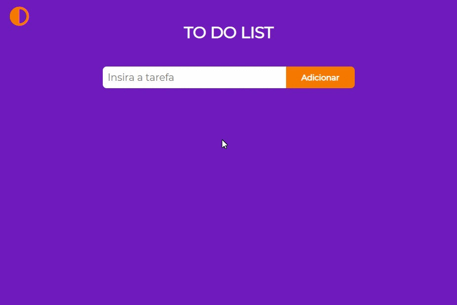

<h1 align="center">
  Lista de Tarefas(to do list)
</h1>

  Projeto desenvolvido para a prática de HTML5, CSS3 e JavaScript :smiley: :v:

<h3 align="center">
  Deploy da Aplicação com Git Pages:
  <a href="https://to-do-list.diegolramos.repl.co" target="__blank">ACESSE AQUI 

</h3>

<h4 align="center">
  Status: Finalizado :white_check_mark:
</h4>

  

  Feito com :heart:

